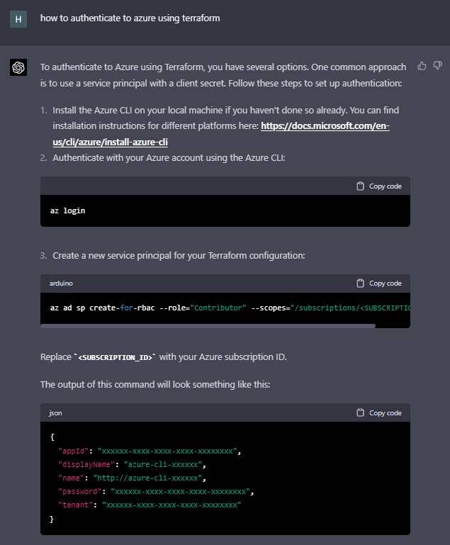
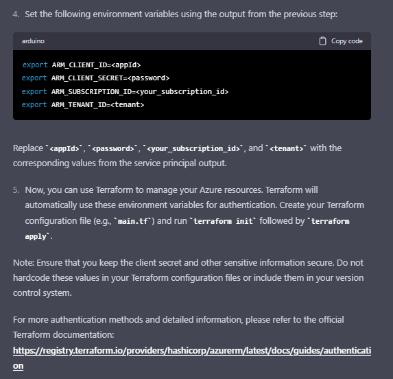

# Terraform devcontainer template repo targetting Azure

The idea is to have a github template repo with generic Terraform devcontainer
functionality targeting Azure. So if you need to spin up AKS, you can base a new repo
based on the template repo and refine to specifically target your terraform Azure needs.

The content of this repo was Inspired by https://www.youtube.com/watch?v=SDa3v4Quj7Y
And created this way:

1/ Create empty repo on GitHub

2/ Install Remote Development extension pack (consists of WSL, Remote - SSH, Dev Containers, Remote - Tunnels) localhost - not in WSL

3/ CTRL + Shift P to access VS Code command palette, type Dev to 

4/ Dev Containers: Clone Repository in Container Volume (for instance hvl71/try-devcontainer, to clone this repo from GitHub)
(not Dev Containers: Open Folder in Container as this cross WSL/Host boundary and is very slow)
Will continue to show "Starting Dev Container" in lower right corner - perfectly OK

5/ Choose devcontainer to start with. In VS Code Command Palette -> Show All Definitions

6/ start-out with Default Linux Universal (bunch of tools pre-installed, used for GitHub codespaces)
After selecting Default Linux Universal, the VS Code Command Palette asks for additional features to be installed.

7/ 	I choose Terraform and click more info. It turns out it comes from the official feature repo here https://github.com/devcontainers/features/tree/main/src/terraform

8/ Additional features can be installed later via the VS Code Command Palette:
Add feature -> Dev Containers -> Configure Container Feature via VS Code Command Palette

9/ In VS Code Terminal, type 'terraform -version" to verify terraform is accessible in the dev container

# Shortcuts

In order to make it fast and easy to work with terraform and Azure I've taken a few shortcuts.

1/ I've hardcoded my git user and email in .gitconfig. This is a bit of a quick and dirty to prevent the credential helper from
the host system to be used. My host system is configured with another git user, I don't want to use in this context. Most users
with only one git user on their system would probably want the opposite. If that is your need. Simply delete the .gitconfig in 
the repo.

2/ There are multiple ways to authenticate to Azure with Terraform. I want to automate it, yet make it simple for a relative
terraform newbie like myself. I use a service principal and expect it to be configured on the host system (or WSL if using that).
There are probably smarter ways. I just want something to up and running and can always revisit. 
Iterations are everything in IT right..

# Authentication

The devcontainer assumes existing authentication is configured. I use an Azure service principal.

ChatGPT explains well how to do it this way:




The commands from the screen shots are

```
az login
```

```
az ad sp create-for-rbac --role="Contributor" --scopes="/subscriptions/<SUBSCRIPTION_ID>"
```

```json
{
  "appId": "xxxxxx-xxxx-xxxx-xxxx-xxxxxxxx",
  "displayName": "azure-cli-xxxxxx",
  "name": "http://azure-cli-xxxxxx",
  "password": "xxxxxx-xxxx-xxxx-xxxx-xxxxxxxx",
  "tenant": "xxxxxx-xxxx-xxxx-xxxx-xxxxxxxx"
}
```

```bash
export ARM_CLIENT_ID=<appId>
export ARM_CLIENT_SECRET=<password>
export ARM_SUBSCRIPTION_ID=<your_subscription_id>
export ARM_TENANT_ID=<tenant>
```